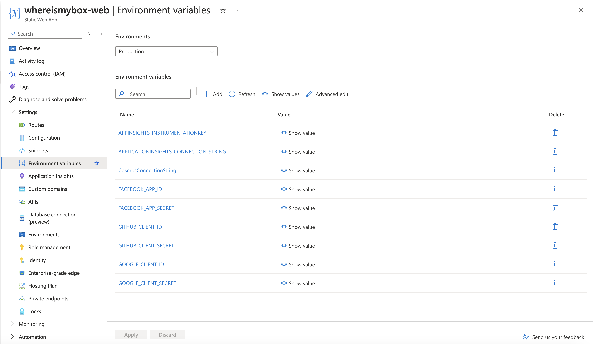

# Boxie

Welcome to [Boxie.se](https://www.boxie.se), a simple web application to help organize your boxes in your attic, basement, or any other storage room.

## Key features
* Create boxes or collection of boxes representing your physical boxes in your attic
* Printable QR-code stickers to put on the physical boxes  
* Scan a sticker to quickly find out what's inside  
* Search for items to figure out in which box you put your long lost bike lock  
* Shared access to boxes with other users 
* Sign in securely using Github or Google 

## Tech stack

* Vue3 frontend
* .NET/C# backend using Azure Functions
* Serverless hosting using Azure Static Web Apps

## Local development

You can run the applications locally together in two different ways.

### Pre-requisites
* .NET 6.0
* Azure core functions tools version 4
* @azure/static-web-apps-cli version 1.1.7 (higher might not work!!)
* Npm v 16.*
* Vue

#### local.settings.json
To start the backend locally you need to have a file called local.settings.json. This file will contain secrets used for the application, and will will replace the secrets that the application pulls from azure when deployed. The local.settings.json file will never be version controlled. To help you get started, there is a default.local.settings.json file that you can copy into a new file called local.settings.json. 

The values of these secrets can be found in the azure portal at the static web apps environment variables


### Alternative 1: Starting the applications individually
1. Start the backend api: 
    1. Alternative: Using IDE: Rider or visual studio is recommended
    2. Using the terminal with Azure core functions tools. Navigate to /api/Functions and type ```func host start```
2. The function app will start at http://localhost:7071
3. Start the frontend application: ```npm run dev```. The dev FE application will start at http://localhost:5173
4. Start the reverse proxy emulation environment: ```npm run swa```

The frontend application will hot reload. Note: If your applications start at different ports you have to edit the npm script to match the ports.

### Alternative 2: 
1. Build the frontend application: ```npm run build```
2. Start the emulation environment: ```npm run swa-dev```

The swa environment will tell you where the application can be reached.


### Api specification
Available at http://localhost:7071/api/swagger/ui  

### Logging in

Azure static web apps does not provide a proper way to authenticate using a real identity provider (e.g. Github or Google). Instead, you will have to manually set all variables to fake a login. Here is a test user you can use:

1. Login using Github  
2. User ID: ```1337```
3. Username: ```testuser```
3. User roles should be ```
anonymous
authenticated
userId.bc8e3597-bcf2-4447-861c-d74195be43b4 ```


## Running postman (or similar) requests against local backend

To test/debug the backend locally you need a local.settings.json file, see above section. Furthermore, you will need to fake a role that you send in. Azure Static Web Apps will not send in a JWT to the backend with the roles. Instead, they set a base64 encoded header with with a json structure of the Claims principal object. 

With your local postman environment, send in a header ```x-ms-client-principal``` with a base64 encoded value. Here is a value you can steal. If you need to change any values, decode, change, and encode :) 

Example request to fetch your collections (Note that the userId must match the userId in the x-ms-client-principal)
```
curl --location 'http://localhost:7071/api/users/bc8e3597-bcf2-4447-861c-d74195be43b4/collections?filter=owner' \
--header 'x-ms-client-principal: ewogICJJZGVudGl0eVByb3ZpZGVyIjogImdpdGh1YiIsCiAgIlVzZXJJZCI6ICJiYzhlMzU5Ny1iY2YyLTQ0NDctODYxYy1kNzQxOTViZTQzYjQiLAogICJVc2VyRGV0YWlscyI6ICJ0ZXN0X3VzZXIiLAogICJVc2VyUm9sZXMiOiBbCiAgICAiYW5vbnltb3VzIiwKICAgICJhdXRoZW50aWNhdGVkIiwKICAgICJ1c2VySWQuYmM4ZTM1OTctYmNmMi00NDQ3LTg2MWMtZDc0MTk1YmU0M2I0IgogIF0KfQ=='
```